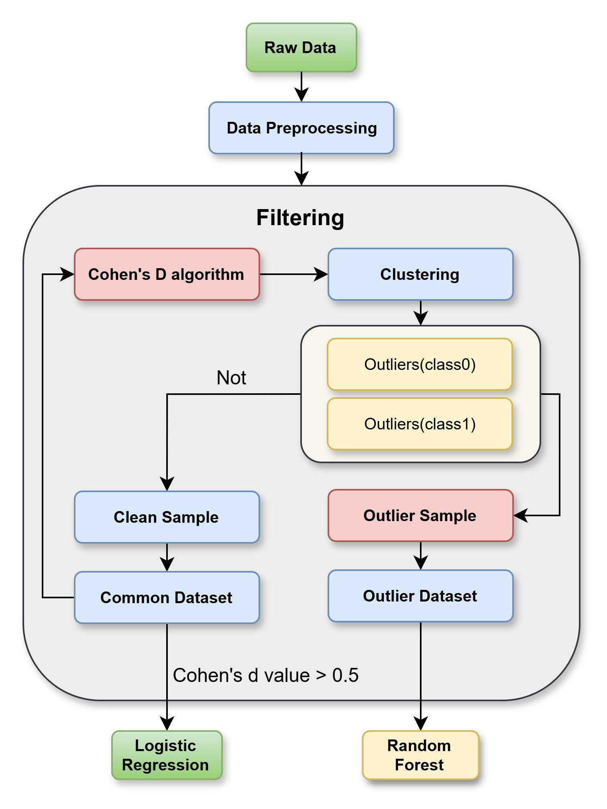
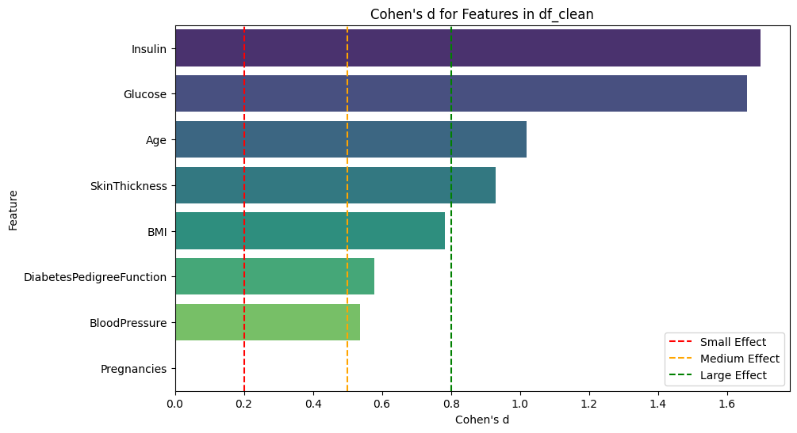
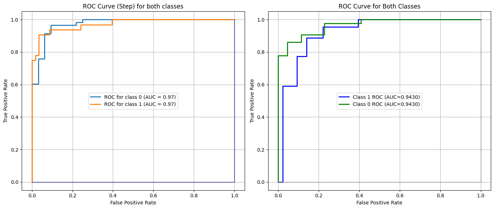

## 1. Project

## A Novel Sample Clustering Method for Diabetes Data Classification

## 2. Giới thiệu (Overview / Description)

Dự án này tập trung xây dựng một pipeline Machine Learning nhằm phân loại bệnh tiểu đường dựa trên bộ dữ liệu Pima Indians Diabetes Dataset.

Mục tiêu chính của project là nghiên cứu ảnh hưởng của các phương pháp tiền xử lý dữ liệu, phát hiện mẫu nhiễu (outlier), phân cụm dữ liệu và các mô hình học máy trong bài toán dự đoán nguy cơ mắc bệnh tiểu đường.

Quy trình được xây dựng bao gồm:

- Phân tích khám phá dữ liệu (Exploratory Data Analysis - EDA) để đánh giá đặc điểm phân phối, tương quan giữa các biến và sự khác biệt giữa nhóm có/không có tiểu đường.
- Xử lý dữ liệu không hợp lệ bằng cách thay thế các giá trị 0 bất thường trong các thuộc tính sinh học bằng phương pháp imputation phù hợp.
- Chuẩn hóa dữ liệu nhằm đưa các biến về cùng một không gian giá trị.
- Áp dụng phương pháp clustering dựa trên KMeans để xác định các mẫu dữ liệu bất thường và tách dữ liệu nhiễu.
- Đánh giá mức độ ảnh hưởng của các đặc trưng thông qua Cohen's d nhằm đo lường sự khác biệt giữa hai nhóm Outcome.
- Huấn luyện và đánh giá các mô hình Machine Learning bao gồm:
  - SGDClassifier với GridSearchCV tối ưu tham số.
  - K-Nearest Neighbors kết hợp Robust Mahalanobis Distance.
  - Logistic Regression với các phương pháp regularization như L1 (Lasso), L2 (Ridge), ElasticNet và Adaptive Lasso.

Project hướng tới xây dựng một hệ thống hỗ trợ phân loại bệnh tiểu đường có khả năng xử lý dữ liệu nhiễu, cải thiện độ ổn định của mô hình và tăng khả năng giải thích thông qua phân tích trọng số đặc trưng.

## 3. Result

Kết quả thực nghiệm sau quá trình tiền xử lý dữ liệu, lọc mẫu dựa trên Cohen's d và huấn luyện mô hình được trình bày dưới đây.

### Pipeline Workflow

  

### Cohen's d Filtering Result

  

### Model Evaluation Result

  

